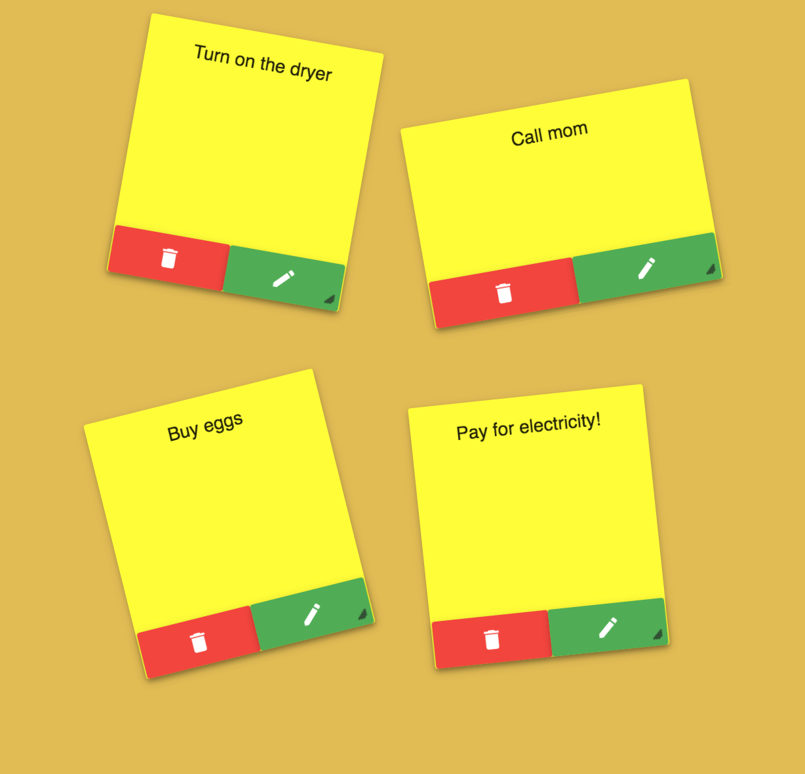

## Stickies

Stickies is an app which lets you manage your todo list with the help of post-its on a virtual wall.
The UI is designed to keep it similar to the experience of using a physical sticky board.



The app allows you to add, edit and delete sticky notes.

## Setup local environment

Setting up the project locally is very easy.

All the dependencies are set up using the Yarn package manager which can be installed [here](https://yarnpkg.com/lang/en/docs/install/).
After installing Yarn you can install said dependencies and run the project with the following commands:

```
yarn install
yarn start
```

## Contributing

If you want to contribute, feel free to check if there are any open issues and make a pull request.
